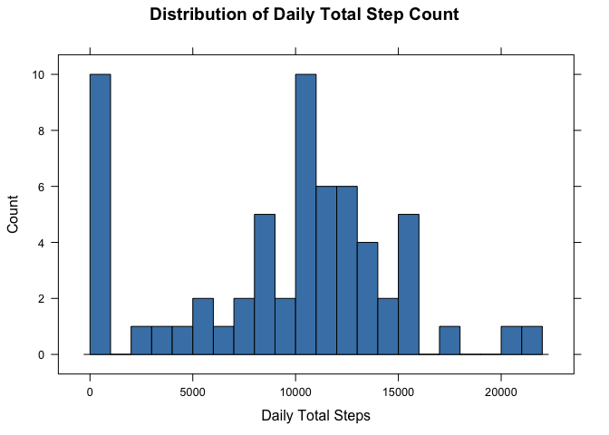
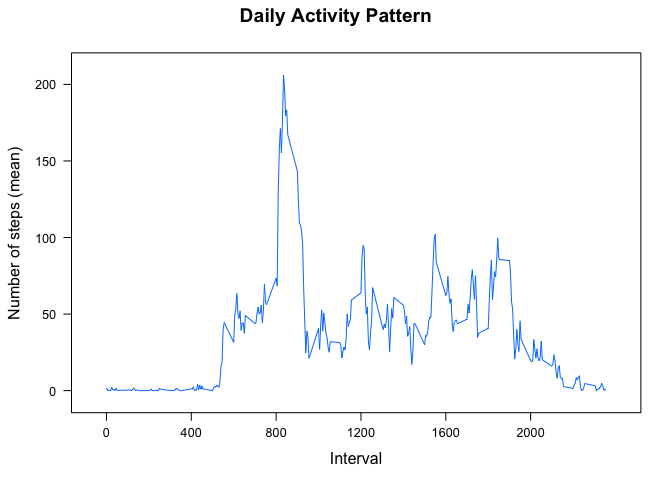
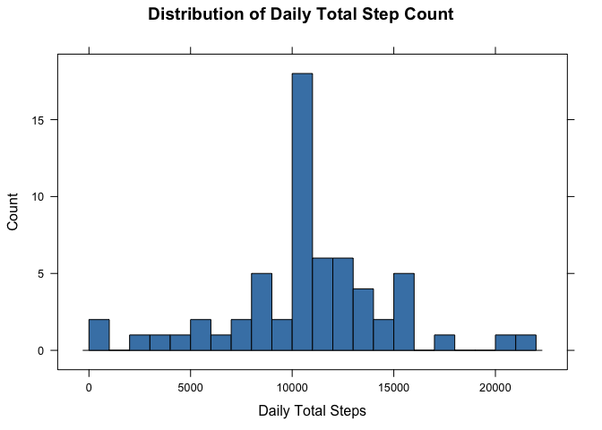
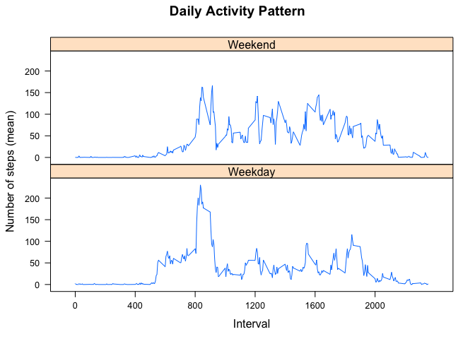

# Reproducible Research: Peer Assessment 1


### Loading and preprocessing the data
#### 0. Required libraries: dplyr, chron, lattice

```r
library(dplyr, warn.conflicts=FALSE) # dplyr masks a couple objects from base
                                     # and stats packages (this is OK) 
library(chron)
library(lattice)
```

#### 1. Load the data (i.e. read.csv())


```r
activity <- tbl_df(read.csv("activity.csv",
                           colClasses=c("integer","Date","integer")))
```

#### 2. Process/transform the data (if necessary) into a format suitable for your analysis
Pre-processing - carve out by-interval information.


```r
# group the dataset by interval and compute the mean number of steps and round
# that value to the nearest integer (used to fix NA data further down)
by_interval <- group_by(activity, interval) %>% summarize(steps_interval_mean = mean(steps, na.rm=TRUE),
                                                          steps_ival_mean_nint=round(steps_interval_mean))
```

### What is mean total number of steps taken per day?
#### 1. Calculate the total number of steps taken per day

```r
# group the dataset by date and compute the total steps per day as a new column
by_date <- group_by(activity, date) %>% summarize(total_steps=sum(steps,na.rm=TRUE))
head(by_date)
```

```
## Source: local data frame [6 x 2]
## 
##         date total_steps
## 1 2012-10-01           0
## 2 2012-10-02         126
## 3 2012-10-03       11352
## 4 2012-10-04       12116
## 5 2012-10-05       13294
## 6 2012-10-06       15420
```


#### 2. Make a histogram of the total number of steps taken each day

```r
histogram(by_date$total_steps,
          breaks=as.integer((max(by_date$total_steps) + 1000)/1000),
          type="count",
          col="gray50",
          main="Distribution of Daily Total Step Count",
          xlab="Daily Total Steps")
```

 


#### 3. Calculate and report the mean and median total number of steps taken per day

Mean steps per day:

```r
# compute the mean number of steps per day
raw_mean <- mean(by_date$total_steps,na.rm=TRUE)
print(paste("Mean steps per day: ",round(raw_mean,2)))
```

```
## [1] "Mean steps per day:  9354.23"
```


Median steps per day:

```r
# compute the median number of steps per day
raw_median <- median(by_date$total_steps,na.rm=TRUE)
print(paste("Median steps per day: ", raw_median))
```

```
## [1] "Median steps per day:  10395"
```


### What is the average daily activity pattern?
#### 1. Make a time series plot (i.e. type = "l") of the 5-minute interval (x-axis) and the average number of steps taken, averaged across all days (y-axis)


```r
xyplot(steps_interval_mean~interval, by_interval,
       main="Daily Activity Pattern",
       type="l",
       ylab="Number of steps (mean)",
       xlab="Interval",
       scales=list(x=list(tck=c(1,0), at=c(0,400,800,1200,1600,2000)),
                   y=list(tck=c(1,0))))
```

 


#### 2. Which 5-minute interval, on average across all the days in the dataset, contains the maximum number of steps?

```r
print(paste("Inverval with highest number of steps: ", 
            by_interval[by_interval$steps_interval_mean==max(by_interval$steps_interval_mean),]$interval,sep=""))
```

```
## [1] "Inverval with highest number of steps: 835"
```

### Imputing missing values
#### 1. Calculate and report the total number of missing values in the dataset (i.e. the total number of rows with NAs)

```r
print(paste("Number of incomplete observations: ", sum(!complete.cases(activity)),
            " out of ", nrow(activity) , " observations.", sep=""))
```

```
## [1] "Number of incomplete observations: 2304 out of 17568 observations."
```

```r
head(activity)
```

```
## Source: local data frame [6 x 3]
## 
##   steps       date interval
## 1    NA 2012-10-01        0
## 2    NA 2012-10-01        5
## 3    NA 2012-10-01       10
## 4    NA 2012-10-01       15
## 5    NA 2012-10-01       20
## 6    NA 2012-10-01       25
```


#### 2. Devise a strategy for filling in all of the missing values in the dataset.

Missing step counts are approximated using the nearest integer to the mean step count for the interval in question. This value was computed in the pre-processing in section 1.2 above.


#### 3. Create a new dataset that is equal to the original dataset but with the missing data filled in.


```r
adj_act <- mutate(activity,
                  steps=ifelse(is.na(steps),
                               by_interval[,by_interval$interval==interval]$steps_ival_mean_nint,
                               steps))

print(paste("Number of incomplete observations: ", sum(!complete.cases(adj_act)),
            " out of ", nrow(adj_act) , " observations.", sep=""))
```

```
## [1] "Number of incomplete observations: 0 out of 17568 observations."
```

```r
head(adj_act)
```

```
## Source: local data frame [6 x 3]
## 
##   steps       date interval
## 1     2 2012-10-01        0
## 2     0 2012-10-01        5
## 3     0 2012-10-01       10
## 4     0 2012-10-01       15
## 5     0 2012-10-01       20
## 6     2 2012-10-01       25
```

#### 4. a) Make a histogram of the total number of steps taken each day

```r
# group the dataset by date and compute the total steps per day as a new column
adj_by_date <- group_by(adj_act, date) %>% summarize(total_steps=sum(steps))

histogram(adj_by_date$total_steps,
          breaks=as.integer((max(by_date$total_steps) + 1000)/1000),
          type="count",
          col="steelblue",
          main="Distribution of Daily Total Step Count",
          xlab="Daily Total Steps")
```

 


#### 4. b) Calculate and report the mean and median total number of steps taken per day. Do these values differ from the estimates from the first part of the assignment? What is the impact of imputing missing data on the estimates of the total daily number of steps?

Adjusted mean steps per day: 


```r
# compute the mean number of steps per day
adj_mean <- mean(adj_by_date$total_steps)
print(paste("Adjusted mean: ", round(adj_mean,2), " Raw mean: ", round(raw_mean,2), "  Change: ", 
            round(((adj_mean - raw_mean)/100),2),"%",sep=""))
```

```
## [1] "Adjusted mean: 10765.64 Raw mean: 9354.23  Change: 14.11%"
```

Adjusted median steps per day:

```r
# compute the median number of steps per day
adj_median <- median(adj_by_date$total_steps)
print(paste("Adjusted median: ", adj_median, " Raw median: ", raw_median, "  Change: ", 
            round(((adj_median - raw_median)/100),2),"%",sep=""))
```

```
## [1] "Adjusted median: 10762 Raw median: 10395  Change: 3.67%"
```


### Are there differences in activity patterns between weekdays and weekends?
#### 1. Create a new factor variable in the dataset with two levels – “weekday” and “weekend” indicating whether a given date is a weekday or weekend day.


```r
# add a factor indicating whether this is a weekend day or not
adj_act <- mutate(adj_act, day_class=as.factor(is.weekend(date)))
```


```r
# group intervals belonging to week day/weekend dates
#  get the mean for each interval
adj_interval <- group_by(adj_act, interval, day_class) %>%
    summarize(steps_interval_mean = mean(steps))
```


#### 2. Make a panel plot containing a time series plot (i.e. type = "l") of the 5-minute interval (x-axis) and the average number of steps taken, averaged across all weekday days or weekend days (y-axis).


```r
# plot weekday/weekend activity
xyplot(steps_interval_mean~interval|factor(day_class,labels=c("Weekday", "Weekend")),
       adj_interval,
       layout=c(1,2),
       main="Daily Activity Pattern",
       type="l",
       ylab="Number of steps (mean)",
       xlab="Interval",
       scales=list(x=list( tck=c(1,0), at=c(0,400,800,1200,1600,2000)),
                   y=list(alternating=FALSE,tck=c(1,0))))
```

 
